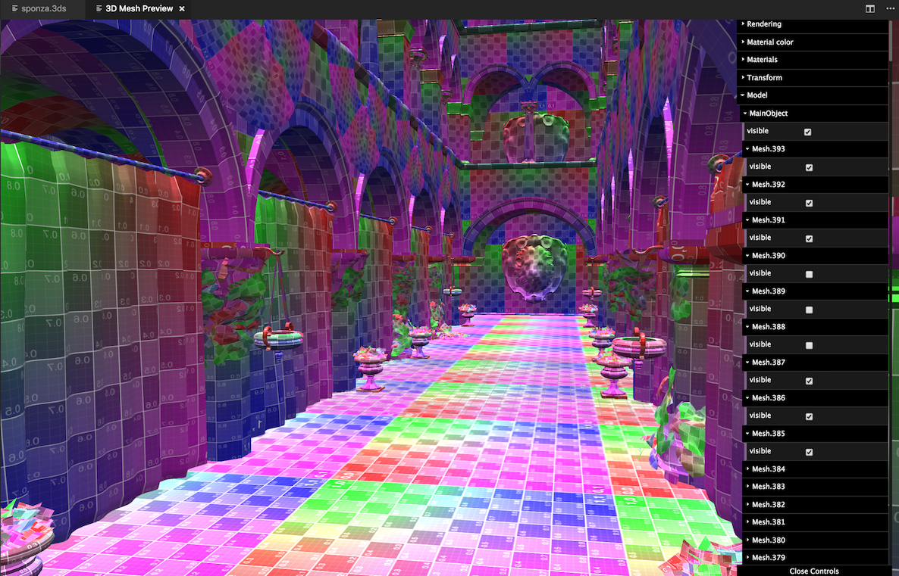
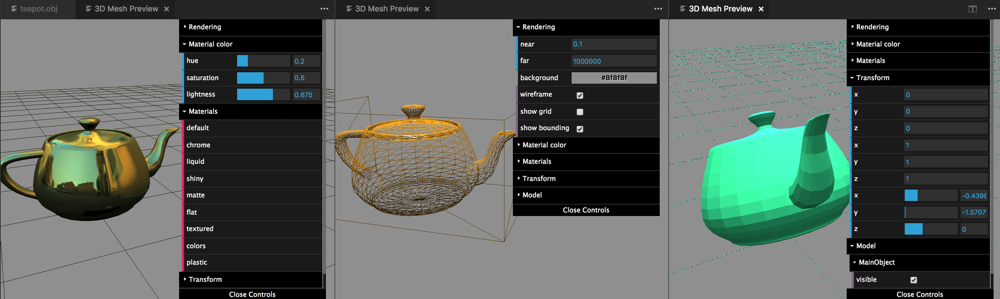
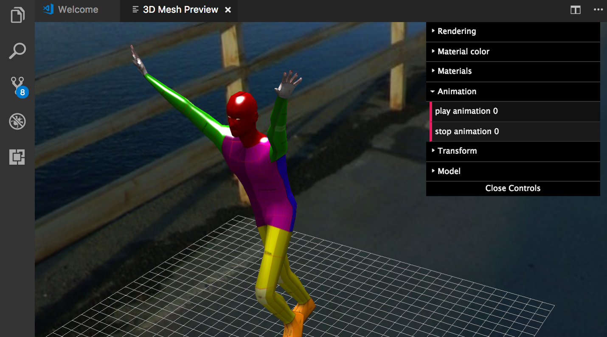
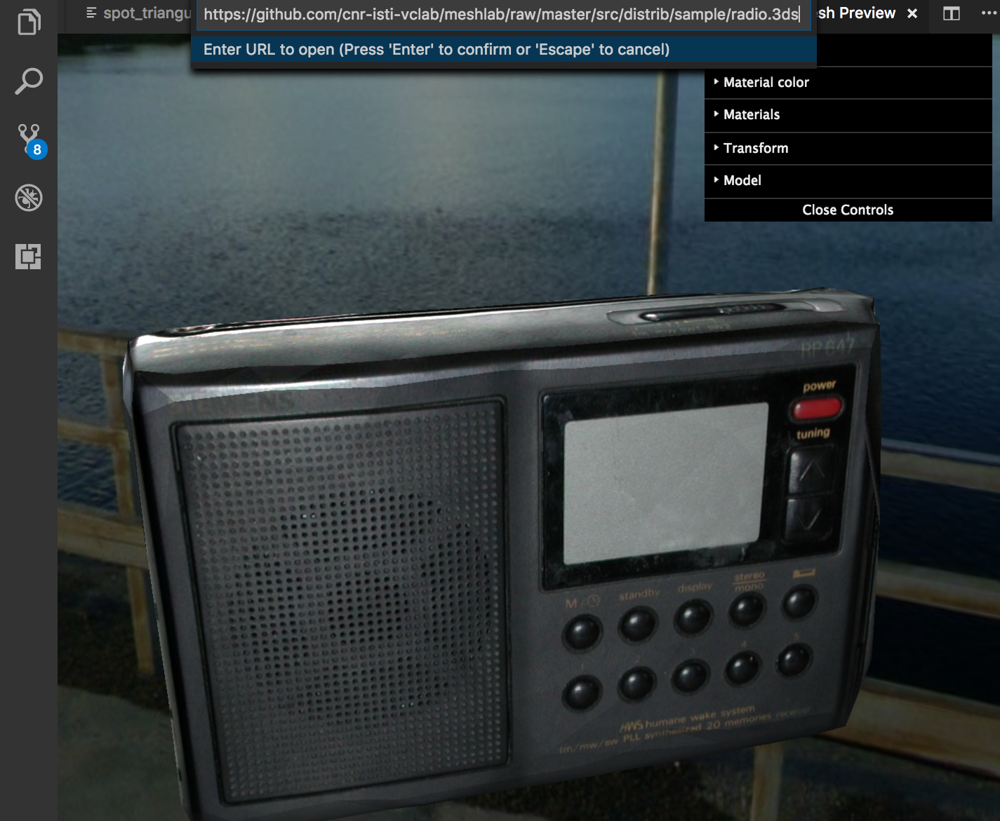
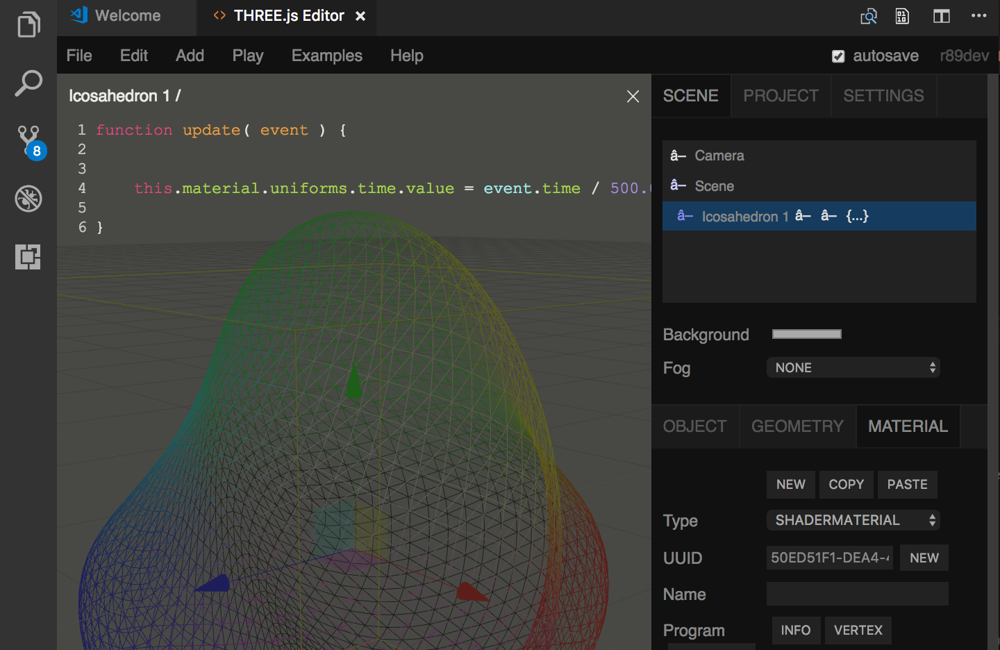

# 3D Viewer for VSCode

## Description

Preview 3D models in VSCode

## Main Features

### Model Viewer
Support multiple formats:
* `3ds` 3D Studio Max
* `dae` Collada digital asset exchange
* `fbx` Filmbox
* `stl` STereo-Lithography
* `obj` Wavefront OBJ

  
  

Several parameters to tweak, like materials, rendering, transform  
  
  

Play animations

  

Open models from disk or online  

  
  ---
  
### THREE.js Editor
Use the [THREE.js editor](https://threejs.org/editor/) directly inside VSCode  

  

## Commands

* From the context menu supported file in the explorer
  * `Open in Editor`
  * `Open in Viewer`
* From the command palette
  * `Open THREE.js Editor`
  * `Open URL in Viewer`

## Configuration

|Name                             |Type      |Description
|---------------------------------|----------|------------
|`3dviewer.wireframe`             |`boolean` |Display mesh in wireframe mode
|`3dviewer.background`            |`string`  |Set the default background color (e.g. '#8f8f8f')
|`3dviewer.boundingBox`           |`boolean` |Display a bounding box around the model
|`3dviewer.grid`                  |`boolean` |Display a grid at the origin
|`3dviewer.gridSize`              |`number`  |Set the size of the grid
|`3dviewer.near`                  |`number`  |Set the near plane distance
|`3dviewer.far`                   |`number`  |Set the far plane distance
|`3dviewer.limitFps`              |`number`  |Set the max fps (use 0 for no limit)
|`3dviewer.hotReload`             |`boolean` |Enable hot reload mode for viewer
|`3dviewer.hotReloadAutomatically`|`boolean` |Enable this to reload models without the question popup

## Contributing

1. Fork it!
2. Create your feature branch: `git checkout -b my-new-feature`
3. Commit your changes: `git commit -am 'Add some feature'`
4. Push to the branch: `git push origin my-new-feature`
5. Submit a pull request :D

## Requirements

Visual Studio Code v1.49.0

## Credits

* [Visual Studio Code](https://code.visualstudio.com/)
* [THREE.js](https://threejs.org)
* [dat.GUI](http://workshop.chromeexperiments.com/examples/gui/#1--Basic-Usage)

## License

[MIT](LICENSE.md)